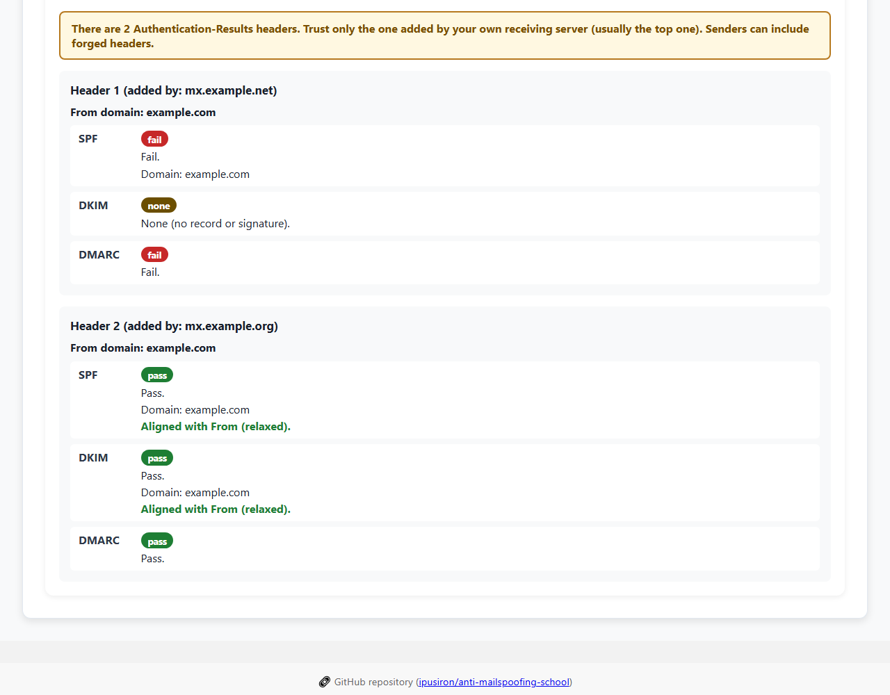
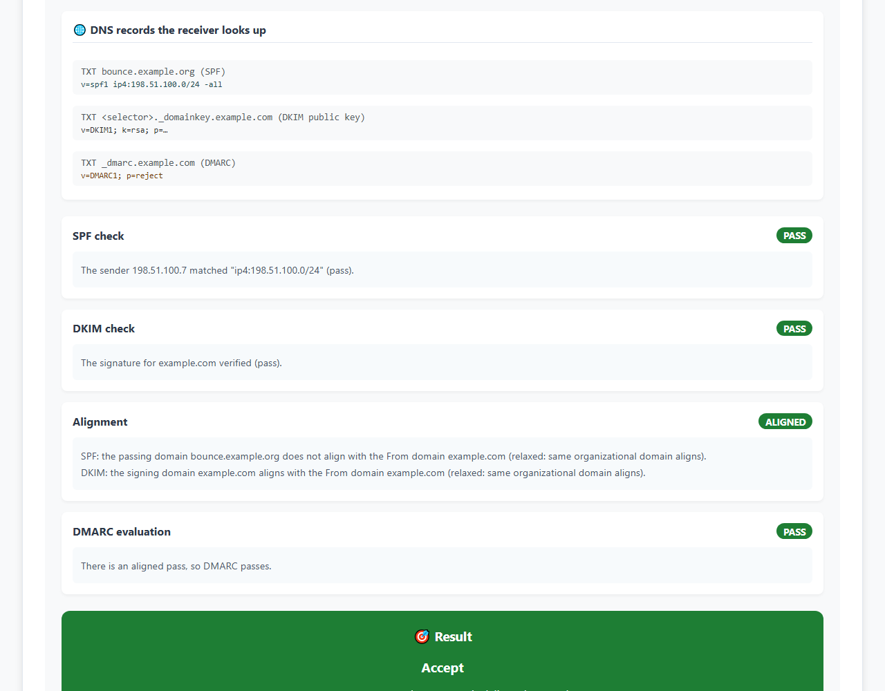
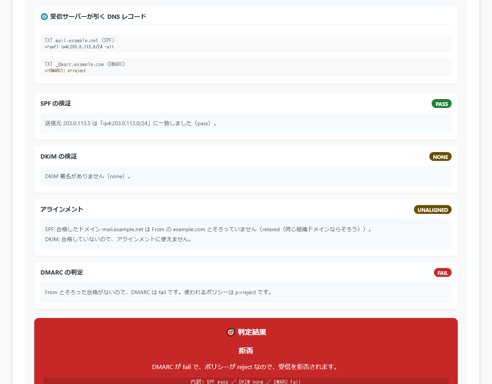
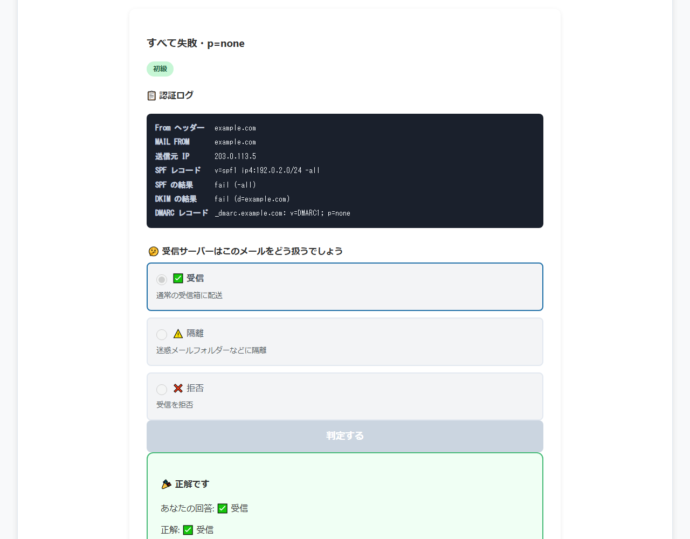
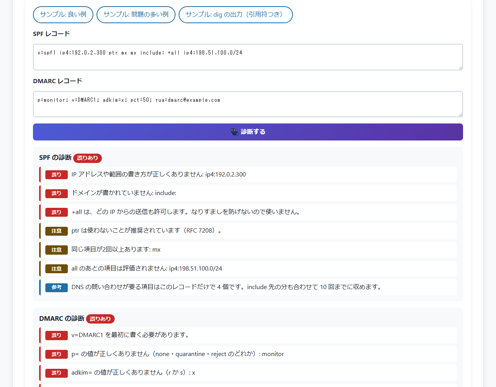

# Anti-MailSpoofing School - Email Spoofing Defense Learning Tool

English · [日本語](README.md)


[](https://ipusiron.github.io/anti-mailspoofing-school/)

**Day035 - 100 Security Tools with Generative AI**

**Anti-MailSpoofing School** is an educational tool for learning email spoofing defenses (SPF, DKIM and DMARC) by doing.

Enter the details of one message and see how a receiving server evaluates it in the order SPF, DKIM, alignment and DMARC. Everything runs in your browser; the tool sends no email and makes no DNS queries.

It can also check how SPF and DMARC records are written and read the Authentication-Results headers of a received message.

---

## 🌐 Demo

👉 [https://ipusiron.github.io/anti-mailspoofing-school/](https://ipusiron.github.io/anti-mailspoofing-school/)

---

## 📸 Screenshots

> 
>
> *Header reader (English UI): the forged lower header claims pass, but only the top one added by your own receiving server can be trusted*

> 
>
> *English UI: with an external sending service, an aligned DKIM signature makes DMARC pass*

> 
>
> *Simulation (Japanese UI): SPF passes for another domain but does not align with From, so the message is rejected*

> 
>
> *Challenge (Japanese UI): read the authentication log and answer accept, quarantine or reject*

> 
>
> *Record checker (Japanese UI): errors, warnings and notes for records with problems*

---

## ✨ Features

### 📘 Learn

- Cards explain SPF, DKIM, DMARC and alignment, each with a delivery analogy
- The authentication flow is shown in five steps; select a step to read its explanation (or play them in order)

### 🧪 Simulation

- Enter the From domain, the MAIL FROM (Return-Path) domain, the sending IP, the SPF record, the DKIM result and signing domain (d=), and the DMARC record
- Shows the DNS records the receiver looks up (such as `TXT <MAIL FROM domain>` and `TXT _dmarc.<organizational domain>`)
- Shows each result and its reason in the order SPF, DKIM, alignment and DMARC, then accept, quarantine or reject
- Suggests improvements based on the result (adding to SPF, alignment, DKIM signing, moving on from p=none)
- Ten presets: legitimate mail, spoofing, SPF passing for another domain, DKIM failure, p=none, forwarding, an external sending service, strict SPF alignment, the subdomain policy, and a partial IP match

### 🎯 Challenge

- Read an authentication log and answer whether the message is accepted, quarantined or rejected
- Four questions each at Beginner, Intermediate and Advanced (twelve in total). The correct answer is computed by the same evaluation as the simulation
- Three correct answers in a row at your highest unlocked level unlock the next level. The same question never appears twice in a row
- An explanation is shown whether the answer is right or wrong

### 🩺 Record checker

- Paste SPF and DMARC records to see syntax errors and risky settings as errors, warnings and notes
- SPF: position of `v=spf1`, duplicate records, unknown terms, address and range syntax, `+all` and `?all`, terms after `all`, `ptr`, the DNS lookup count (limit 10) and length over 255 characters
- SPF ranges: `ip4:0.0.0.0/0` (the same as `+all`) is an error, and pass ranges wider than /16 for IPv4 or /32 for IPv6 are warnings. Duplicate terms are warnings too
- You can paste `dig` output as is. The quoted strings are taken out, and a TXT record split every 255 characters (`"…" "…"`) is joined without spaces
- DMARC: `v=DMARC1` first, values of `p=`, `sp=`, `adkim=`, `aspf=` and `pct=`, `mailto:` in `rua=` and `ruf=`, duplicate and unknown tags, `p=none` staying at monitoring, and a missing `rua=`
- Three samples: a good record, a record with problems, and `dig` output (quoted and split)

### 📨 Header reader

- Paste the headers of a received message to read the spf, dkim and dmarc results in `Authentication-Results`
- Handles folded lines and comments in parentheses, and shows whether SPF `smtp.mailfrom` and DKIM `header.d` align with `header.from` (relaxed)
- With two or more `Authentication-Results` headers, warns that only the one added by your own receiving server (usually the top one) can be trusted
- Three samples: everything passes, spoofing (with a forged header) and forwarding

### 🌏 Japanese and English, help

- The button at the top right switches between Japanese and English (you can also use `?lang=ja|en` in the URL)
- The "?" button at the top right opens the help

---

## 📖 Usage

1. In **📘 Learn**, read the four cards and the authentication flow
2. In **🧪 Simulation**, evaluate the presets one by one and compare the results. Edit the values to try your own conditions
3. In **🎯 Challenge**, predict the handling from the authentication log. Read the explanations as you move up to Advanced
4. In **🩺 Record checker**, paste your domain's SPF and DMARC records (the values of the DNS TXT records)
5. In **📨 Header reader**, paste the headers of a received message (for example from "View source" in your mail client) and read the results

The tool works when the file is opened directly (file://) and when served from a web server.

---

## 🎓 Audience

- Students and professionals who want to understand email spoofing defenses
- Beginners confused about how SPF, DKIM and DMARC differ and work together
- Security educators and instructors
- People who run mail servers but are unsure about the authentication flow

---

## 🛡️ A structured overview of email security

### Background of email spoofing

The email transfer protocol (SMTP) was standardized in 1982 (RFC 821). It originally had no way to check who the sender was, so anyone could write any name as the sender (From). Attackers have long used this to impersonate other people and organizations.

#### Main threats

- **Phishing**: scam emails that pretend to come from legitimate companies
- **Business email compromise (BEC)**: payment fraud that impersonates executives or business partners
- **Malware distribution**: spreading malware by posing as a trusted sender
- **Brand abuse**: spoofed emails that damage a company's reputation

### How email authentication evolved

To counter these threats, three authentication technologies were developed step by step.

- **SPF** (proposed in 2003; the current specification is RFC 7208): checks whether the sending IP address is legitimate
- **DKIM** (RFC 4871, 2007; the current specification is RFC 6376): checks that the message was not altered and identifies the signing domain
- **DMARC** (specification published in 2012; RFC 7489): matches the SPF and DKIM results against the From domain and declares how failures should be handled

---

## 🧰 How SPF / DKIM / DMARC work

Each technology is explained with **a parcel delivery analogy**.

### 📦 SPF (checking the courier's employer)

> 🕵️‍♂️ "Is this courier (IP address) registered as allowed to deliver for the company they claim (the MAIL FROM domain)?"

- The receiver looks up the SPF record of the MAIL FROM (Return-Path) domain in DNS and checks whether the sending IP is included
- Results include pass, fail, softfail, neutral, none and permerror
- Analogy: checking that a courier appears on the staff list of the company they claim to work for

### ✍️ DKIM (seal and signature on the parcel)

> ✉️ "The sender really sealed this parcel (message), and the contents were not changed on the way."

- The sender signs with a private key and names the signing domain in d=. The public key for verification is published in DNS
- The receiver verifies the signature with the public key. The signature survives forwarding
- Analogy: an envelope stamped with the sender's seal that shows it has not been opened

### 🧑‍⚖️ DMARC (handling by the rules)

> 📜 "How does the company in From want parcels that fail authentication to be handled?"

- The owner of the From domain publishes a DMARC record at `_dmarc.<domain>`
- DMARC passes when SPF or DKIM passes and that domain aligns with From
- p= (none, quarantine, reject) states the handling requested when DMARC fails. sp= can be used for subdomains
- Analogy: a building manager handling deliveries according to the rules the residents set

### 🪪 Alignment (name badge matches the sender)

> 🧐 "Is the company of the courier who passed the check the same as the company written as the sender?"

- An attacker can pass SPF or DKIM with their own domain, so DMARC also checks whether the passing domain aligns with From
- Relaxed (the default): the same organizational domain aligns (for example, `bounce.example.com` and `example.com`)
- Strict (`aspf=s`, `adkim=s`): only the exact same domain aligns

### 🧠 Summary

| Technology | Purpose | What it checks | Analogy |
|------|------|----------|--------|
| SPF | Is the sender legitimate? | MAIL FROM domain and sending IP | Checking the courier's employer |
| DKIM | Was it altered, and who signed it? | Signature and the d= domain | Seal and signature |
| DMARC | How should failures be handled? | An aligned SPF or DKIM pass | The building manager's rule sheet |
| Alignment | Does it match From? | From and each domain | Badge matches the sender |

### ❗ Common misconceptions

- An SPF pass does not count for DMARC unless its domain aligns with From (this stops spoofing through a pass for another domain)
- DMARC passes with **either** an aligned SPF pass or an aligned DKIM pass
- An SPF softfail (`~all`) does not count as a pass for DMARC
- `p=none` does not mean "pass"; it means "request no action (monitoring only)". The DMARC result is still fail
- Forwarding tends to break SPF. The DKIM signature survives, so DMARC passes if DKIM is aligned

---

## 🔬 Specification and Known Answers

All evaluation lives in `js/mailauth-core.js`, and both the simulation and the challenge use it.

- **SPF** (RFC 7208): terms are evaluated from left to right, and the qualifier of the first matching term decides the result (`+` pass, `-` fail, `~` softfail, `?` neutral). `ip4` and `ip6` are matched as CIDR ranges, never as partial text matches. If nothing matches and there is no `all`, the result is neutral; with no record it is none; malformed records give permerror
- **DMARC** (RFC 7489): for the From domain, it checks whether an SPF pass aligns through the MAIL FROM domain and whether a DKIM pass aligns through the d= domain. Either one aligned makes DMARC pass. On fail, the handling is p= when From is the organizational domain itself, and sp= (or p= if absent) when From is a subdomain
- **Organizational domain**: the two rightmost labels. Two-label public suffixes such as `co.jp` and `co.uk` come from a short list and give three labels

Errors in the previous version and their fixes:

- SPF used a partial text match, so the record `ip4:192.0.2.10` let the sender `192.0.2.1` pass (the last row of the table below)
- Alignment was ignored, so spoofing through an SPF pass for another domain went undetected. The answer to an advanced challenge question (subdomains) was also wrong

### SPF known answers

| SPF record | Sending IP | Result |
| --- | --- | --- |
| `v=spf1 ip4:192.0.2.0/24 -all` | `192.0.2.1` | `pass` |
| `v=spf1 ip4:192.0.2.0/24 -all` | `203.0.113.5` | `fail` |
| `v=spf1 ip4:192.0.2.0/24 ~all` | `203.0.113.5` | `softfail` |
| `v=spf1 ip6:2001:db8::/32 -all` | `2001:db8::25` | `pass` |
| `v=spf1 include:_spf.example.net ?all` | `198.51.100.7` | `neutral` |
| `v=spf1 ip4:192.0.2.300 -all` | `192.0.2.1` | `permerror` |
| (none) | `192.0.2.1` | `none` |
| `v=spf1 ip4:192.0.2.10 -all` | `192.0.2.1` | `fail` |

### Preset results

| Scenario | From | MAIL FROM | Sending IP | SPF | DKIM | DMARC record | DMARC | Handling |
| --- | --- | --- | --- | --- | --- | --- | --- | --- |
| Legitimate mail (`normal`) | `example.com` | `example.com` | `192.0.2.1` | `pass` | `pass (d=example.com)` | `v=DMARC1; p=reject` | `pass` | `accept` |
| Spoofing (SPF fails) (`spoof`) | `example.com` | `example.com` | `203.0.113.5` | `fail` | `none` | `v=DMARC1; p=reject` | `fail` | `reject` |
| SPF passes for another domain (`unaligned`) | `example.com` | `mail.example.net` | `203.0.113.5` | `pass` | `none` | `v=DMARC1; p=reject` | `fail` | `reject` |
| DKIM fails, SPF saves it (`dkim-fail`) | `example.com` | `example.com` | `192.0.2.1` | `pass` | `fail (d=example.com)` | `v=DMARC1; p=quarantine` | `pass` | `accept` |
| Everything fails, p=none (`monitor`) | `example.com` | `example.com` | `203.0.113.5` | `fail` | `fail (d=example.com)` | `v=DMARC1; p=none` | `fail` | `accept` |
| Forwarded mail (`forwarded`) | `example.com` | `example.com` | `198.51.100.20` | `fail` | `pass (d=example.com)` | `v=DMARC1; p=reject` | `pass` | `accept` |
| External sending service (`esp`) | `example.com` | `bounce.example.org` | `198.51.100.7` | `pass` | `pass (d=example.com)` | `v=DMARC1; p=reject` | `pass` | `accept` |
| Strict SPF alignment (`strict`) | `example.com` | `bounce.example.com` | `192.0.2.1` | `pass` | `none` | `v=DMARC1; p=reject; aspf=s` | `fail` | `reject` |
| Subdomain policy (`subdomain`) | `news.example.com` | `news.example.com` | `203.0.113.9` | `fail` | `fail (d=news.example.com)` | `v=DMARC1; p=reject; sp=quarantine` | `fail` | `quarantine` |
| Beware partial IP matches (`substring`) | `example.com` | `example.com` | `192.0.2.1` | `fail` | `none` | `v=DMARC1; p=quarantine` | `fail` | `quarantine` |

### Record checker known answers

Results of `lintSpf()` and `lintDmarc()` in `js/mailauth-tools.js`.

| Kind | Record | Status | Findings |
| --- | --- | --- | --- |
| SPF | `v=spf1 ip4:192.0.2.0/24 include:_spf.example.net -all` | `ok` | Note: This record alone has 1 terms that need DNS lookups. Keep the total, including nested includes, within 10.<br>Note: -all makes other senders fail. |
| SPF | `v=spf1 ip4:192.0.2.0/24 ~all` | `ok` | Note: ~all gives other senders softfail. DMARC does not count it as a pass. |
| SPF | `v=spf1 +all` | `error` | Error: +all allows mail from any IP address. It cannot stop spoofing; do not use it. |
| SPF | `v=spf1 include:_spf.example.net` | `warning` | Warning: There is neither all nor redirect=. Senders that match nothing get neutral.<br>Note: This record alone has 1 terms that need DNS lookups. Keep the total, including nested includes, within 10. |
| SPF | `v=spf1 ip4:192.0.2.300 ptr -all ip4:198.51.100.0/24` | `error` | Error: The address or range is malformed: ip4:192.0.2.300<br>Warning: ptr should not be used (RFC 7208).<br>Warning: Terms after all are never evaluated: ip4:198.51.100.0/24<br>Note: This record alone has 1 terms that need DNS lookups. Keep the total, including nested includes, within 10.<br>Note: -all makes other senders fail. |
| SPF | `example.com. 300 IN TXT "v=spf1 ip4:192.0.2.0/24 " "include:_spf.example.net -all"` | `ok` | Note: Quotes were removed and 2 strings were joined without spaces before checking (how a TXT record split every 255 characters is read).<br>Note: This record alone has 1 terms that need DNS lookups. Keep the total, including nested includes, within 10.<br>Note: -all makes other senders fail. |
| SPF | `v=spf1 ip4:0.0.0.0/0 -all` | `error` | Error: ip4:0.0.0.0/0 allows every IP address. It is the same as +all and cannot stop spoofing.<br>Note: -all makes other senders fail. |
| SPF | `v=spf1 ip4:192.0.0.0/8 mx mx -all` | `warning` | Warning: ip4:192.0.0.0/8 is too broad (wider than /16). List only the ranges of your sending servers.<br>Warning: The same term appears more than once: mx<br>Note: This record alone has 2 terms that need DNS lookups. Keep the total, including nested includes, within 10.<br>Note: -all makes other senders fail. |
| DMARC | `v=DMARC1; p=reject; sp=reject; rua=mailto:dmarc@example.com` | `ok` | Note: p=reject asks receivers to reject failing mail. |
| DMARC | `v=DMARC1; p=none` | `warning` | Warning: There is no rua= (where aggregate reports go). Reports help confirm legitimate senders.<br>Note: p=none only monitors. Check the aggregate reports, then move to quarantine and then reject.<br>Note: There is no sp=, so subdomains also use p=none. |
| DMARC | `p=reject; v=DMARC1; adkim=x; rua=dmarc@example.com` | `error` | Error: v=DMARC1 must come first.<br>Error: Invalid adkim= value (use r or s): x<br>Error: The rua= destination must start with mailto: dmarc@example.com<br>Note: p=reject asks receivers to reject failing mail.<br>Note: There is no sp=, so subdomains also use p=reject. |

### Header reader known answers

The header reader samples read with `readHeaders()`. ✓ means aligned with From, ✗ means not aligned, and — means not checked because the result is not a pass.

| Sample | Order | Added by | SPF | DKIM | DMARC |
| --- | --- | --- | --- | --- | --- |
| everything passes (`pass`) | 1 | `mx.example.net` | `pass` bounce.example.com ✓ | `pass` example.com ✓ | `pass` |
| spoofing (`spoof`) | 1 | `mx.example.net` | `fail` example.com — | `none` — | `fail` |
| spoofing (`spoof`) | 2 | `mx.example.org` | `pass` example.com ✓ | `pass` example.com ✓ | `pass` |
| forwarded (`forward`) | 1 | `mx.example.net` | `softfail` example.com — | `pass` example.com ✓ | `pass` |

### Simplifications

- SPF `include`, `a`, `mx`, `exists`, `ptr` and `redirect=` need DNS lookups, so they are not evaluated and are listed as terms not evaluated
- Organizational domains come from a short list (real receivers use the Public Suffix List)
- DKIM is chosen as a result (pass, fail, none) with a signing domain; no signature is computed
- DMARC `pct=` and the receiver's own local policy are not modeled
- The record checker does not fetch included records, so DNS lookups are counted within the pasted record only
- The header reader cannot tell whether a header is genuine. Alignment is shown in relaxed mode only

---

## 🔬 Technical details

### SPF record

```dns
; SPF record example
example.com. IN TXT "v=spf1 ip4:192.0.2.0/24 include:_spf.example.net -all"
```

- `v=spf1`: SPF version 1
- `ip4:192.0.2.0/24`: an allowed IPv4 range (`ip6:` for IPv6)
- `include:_spf.example.net`: includes another domain's SPF record
- `-all`: everything else fails (strict) / `~all`: softfail / `?all`: neutral / `+all`: allow everything (do not use)

### DKIM record

```dns
; DKIM public key example (selector selector1)
selector1._domainkey.example.com. IN TXT "v=DKIM1; k=rsa; p=MIGfMA0GCS..."
```

1. Sender: signs headers and body with a private key and writes values such as `d=example.com; s=selector1`
2. DNS: the public key is published in the TXT record `<selector>._domainkey.<domain>`
3. Receiver: fetches the public key from DNS and verifies the signature

### DMARC record

```dns
; DMARC record example
_dmarc.example.com. IN TXT "v=DMARC1; p=quarantine; sp=reject; adkim=r; aspf=r; rua=mailto:dmarc@example.com"
```

- `p=none`: request no action (monitoring only)
- `p=quarantine`: request quarantine, such as a spam folder
- `p=reject`: request rejection
- `sp=`: the policy for subdomains (the same as p= if absent)
- `adkim=`, `aspf=`: alignment mode (`r` relaxed, `s` strict; the default is r)
- `rua=`: where aggregate reports are sent

---

## 🏢 A staged deployment approach

### Phase 1: monitor and analyze

1. **SPF**: list every server that sends your mail and start with `~all`
2. **DKIM**: sign mail from the main sending systems for the From domain
3. **DMARC**: collect aggregate reports with `p=none` and `rua=`, and confirm the legitimate senders

### Phase 2: tighten step by step

1. **SPF**: remove unnecessary permissions and switch to `-all`
2. **DKIM**: have every sending path, including external services, sign for the From domain
3. **DMARC**: raise to `p=quarantine` and check the effect

### Phase 3: full protection

1. **DMARC**: switch to `p=reject`
2. **Continuous monitoring**: use aggregate reports to find new senders and missing settings
3. **Subdomains**: protect them too with `sp=reject`

---

## 🎯 Use cases

### Ways of using this tool in particular

- Confirming that SPF checks whether the sender IP is in the allowed range (email-authentication classes): SPF checks whether the actual sender IP is within the range the sender's domain declared as "allowed to send from this IP". With `v=spf1 ip4:192.0.2.0/24 -all`, 192.0.2.10 passes and the out-of-range 203.0.113.5 fails. You can confirm the mechanism of preventing spoofing by IP address range
- Confirming that even an SPF pass is rejected by DMARC when the sender does not match (alignment classes): when the From is example.com but the domain that passes SPF is evil.com, SPF itself passes, but because it does not match (align with) the From, DMARC fails, and with a reject policy it is rejected. You can confirm that an SPF pass alone does not guarantee the visible sender and that DMARC's alignment check is needed
- Confirming that the organizational domain is decided by the public suffix (domain classes): the alignment check compares organizational domains, not host names. The organizational domain of `mail.example.co.jp` treats `co.jp` as a two-label suffix by the Public Suffix List and is `example.co.jp`. You can confirm deciding how far the organization's domain reaches from the right

### General uses

- Learn how SPF, DKIM and DMARC work and the flow by which a spoofed email is rejected
- Use it as material to consider your organization's DMARC policy (none, quarantine or reject)
- Explain the idea of alignment in email authentication

## 🔒 Security of This Tool

- No email sending, no DNS queries and no network access (CSP `default-src 'none'`)
- The CSP uses `script-src 'self'` and `style-src 'self'`; there are no inline scripts or styles
- Input is shown with DOM `textContent` and is never interpreted as HTML
- Pasted records and headers are processed only in the browser and are neither stored nor sent
- localStorage stores only the display language (the tool works when storage is unavailable)

---

## 🧪 Tests

```bash
npm test
```

- Node.js 22 or later. No dependencies (`node --test`)
- GitHub Actions runs them on every push and pull request
- `test/core.test.js`: SPF, organizational domains, alignment and DMARC evaluation
- `test/data.test.js`: the presets and twelve questions (answers are computed), use of documentation domains and addresses only, and challenge progression
- `test/html.test.js`: CSP, ARIA and forbidden patterns (innerHTML, inline handlers and so on)
- `test/i18n.test.js`: matching Japanese and English keys, no Japanese left in English
- `test/tools.test.js`: record checker findings, the DNS lookup count, header reading and alignment, and Japanese and English text for every finding
- `test/contrast.test.js`: color contrast ratios
- `test/format.test.js`: line lengths and file sizes
- `test/readme.test.js`: the tables, structure and images of this README and README.md

---

## 📁 Directory Structure

```
anti-mailspoofing-school/
├── .github/                 # GitHub settings
│   └── workflows/           # GitHub Actions workflows
│       └── test.yml         # Runs npm test on push and pull_request
├── assets/                  # Images
│   ├── en/                  # Screenshots of the English UI
│   │   ├── screenshot.png   # English simulation (external sending service)
│   │   └── screenshot2.png  # English header reader (with a forged header)
│   ├── screenshot.png       # Simulation (SPF passes for another domain, rejected)
│   ├── screenshot2.png      # Challenge after answering
│   └── screenshot3.png      # Record checker (example with problems)
├── js/                      # Scripts (classic scripts)
│   ├── challenge-logic.js   # Challenge progression rules (no DOM)
│   ├── challenge.js         # Challenge tab
│   ├── checker.js           # Record checker tab
│   ├── headers.js           # Header reader tab
│   ├── i18n.js              # Japanese and English messages, language switching
│   ├── learn.js             # Learn tab
│   ├── mailauth-core.js     # SPF, alignment and DMARC evaluation (no DOM)
│   ├── mailauth-data.js     # Ten presets, twelve questions and samples
│   ├── mailauth-tools.js    # Record syntax checks and header reading (no DOM)
│   ├── main.js              # Tabs, help and language switching
│   └── simulate.js          # Simulation tab
├── test/                    # Automated tests (node --test)
│   ├── contrast.test.js     # Color contrast ratios
│   ├── core.test.js         # Evaluation logic
│   ├── data.test.js         # Presets, questions and challenge progression
│   ├── format.test.js       # Line lengths and file sizes
│   ├── html.test.js         # CSP, ARIA and forbidden patterns
│   ├── i18n.test.js         # Japanese and English messages
│   ├── readme.test.js       # README tables, structure and images
│   └── tools.test.js        # Record checker and header reader
├── .gitignore               # Files ignored by Git
├── .nojekyll                # Disables Jekyll on GitHub Pages
├── CLAUDE.md                # Notes for Claude Code (English)
├── LICENSE                  # MIT license
├── README.en.md             # English README
├── README.md                # Japanese README
├── index.html               # Page with five tabs
├── package.json             # npm test configuration (no dependencies)
└── style.css                # Styles
```

---

## 💻 Requirements

- Recent versions of Chrome, Edge, Firefox and Safari
- Works when opened directly (file://) and from a web server
- Usable on smartphones down to 320px wide

---

## 📄 License

MIT License - see [LICENSE](LICENSE) for details.

---

## 🛠️ About This Tool

This tool was developed as part of the "100 Security Tools with Generative AI" project. In this project, a variety of security-related tools are built with the help of AI and published over 100 days.

For details of the project and the other tools, see the page below.

🔗 [https://akademeia.info/?page_id=42163](https://akademeia.info/?page_id=42163)
