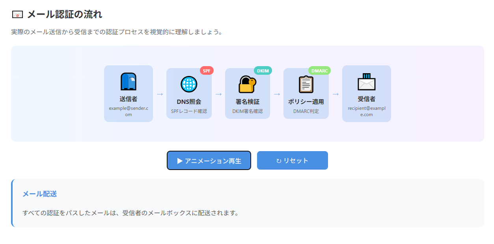

<!--
---
id: day035
slug: anti-mailspoofing-school

title: "Anti-MailSpoofing School"

subtitle_ja: "メールなりすまし対策学習ツール"
subtitle_en: "Email Spoofing Defense Learning Tool"

description_ja: "SPF/DKIM/DMARCの仕組みを視覚的・体験的に学べる教育用Webアプリ。学習モード、シミュレーションモード、チャレンジモードの3つのモードで段階的に理解を深められます。"
description_en: "An educational web app for learning SPF/DKIM/DMARC email authentication mechanisms through visual explanations, interactive simulations, and progressive challenges."

category_ja:
  - メールセキュリティ
category_en:
  - Email Security

difficulty: 2

tags:
  - SPF
  - DKIM
  - DMARC
  - email-authentication
  - phishing-prevention
  - security-education

repo_url: "https://github.com/ipusiron/anti-mailspoofing-school"
demo_url: "https://ipusiron.github.io/anti-mailspoofing-school/"

hub: true
---
-->

# Anti-MailSpoofing School - メールなりすまし対策学習ツール


[](https://ipusiron.github.io/anti-mailspoofing-school/)

**Day035 - 生成AIで作るセキュリティツール100**

**Anti-MailSpoofing School** は、メールなりすまし対策を学べる教育用ツールです。

メールのなりすまし攻撃（Mail Spoofing）に対抗するための仕組み（SPF/DKIM/DMARC）を、視覚的かつ体験的に学べます。

---

## 🌐 デモページ

👉 [https://ipusiron.github.io/anti-mailspoofing-school/](https://ipusiron.github.io/anti-mailspoofing-school/)

---

## 📸 スクリーンショット

> 
>
> *メール認証の流れ*

---

## 🔰 このツールでできること

本ツールは以下の3つの学習モードを備えています。

---
### 📘 1. 学習モード（Learn）

**SPF/DKIM/DMARCの基本概念を直感的に理解**

- **視覚的な解説**: 宅配便のたとえ話で技術的概念を分かりやすく説明
- **インタラクティブフロー図**: クリック可能なアニメーション付きメール認証プロセス
- **ステップ詳細**: 各認証段階の詳細な説明とその意味を表示
- **技術仕様**: 実際のDNSレコードや実装方法の説明

---
### 🧪 2. シミュレーションモード（Simulate）

**実際のメール認証をリアルタイムでシミュレーション**

- **7つのプリセットシナリオ**: 
  - 正常なメール配送
  - SPF失敗（なりすまし）
  - DKIM失敗（改ざん検知）
  - 設定ミスパターン
  - 完全失敗（reject）など
- **カスタム入力**: 独自のIPアドレス、SPFレコード、DMARCポリシーを設定
- **ステップ実行**:「SPF → DKIM → DMARC」の順で段階的に結果を表示
- **DNS可視化**: DNSレコード照会の流れを図解
- **詳細解説モード**: 各ステップの技術的詳細と理由を解説
- **セキュリティ改善提案**: 現在の設定に基づく推奨事項とアクション

---
### 🎯 3. チャレンジモード（Challenge）

**実践的なクイズで理解度を段階的にテスト**

- **3段階の難易度システム**:
  - 🟢 **初級**: 基本的な判定パターン（3問）
  - 🟡 **中級**: 複雑なケース（3問）
  - 🔴 **上級**: 実践的シナリオ（3問）
- **連続正解システム**: 3回連続正解で次のレベル解放
- **プログレッシブ学習**: 段階的にレベルアップして学習効果を最大化
- **詳細な解説**: 正答・誤答にかかわらず、各問題に詳しい解説を提供
- **進捗管理**: 正答率、連続正解数、現在のレベルをリアルタイム表示
- **完全クリア**: 上級レベルで3回連続正解すると「メール認証スペシャリスト」達成
- **連打防止機能**: 不正な回答を防ぐセキュリティ機能搭載

---
### 🆘 4. ヘルプ機能

**いつでもアクセス可能な包括的なガイド**

- **ワンクリックアクセス**: 右上のヘルプボタンからいつでも利用可能
- **機能別説明**: 各モードの使い方と学習のコツ
- **技術仕様**: 実装詳細と対応ブラウザ情報
- **学習ガイド**: 効果的な学習順序の提案

---

## 🚀 使い方

### 推奨学習フロー
1. **📘 学習モード** でSPF/DKIM/DMARCの基本概念を理解
2. **🧪 シミュレーションモード** でプリセットシナリオを実行して動作を確認
3. **🎯 チャレンジモード** で理解度をテストし、段階的にレベルアップ
4. **🆘 ヘルプ** で詳細な使い方やコツを随時確認

---
### 初心者向けガイド
- まず学習モードのアニメーション機能で全体の流れを把握
- シミュレーションモードの「正常なメール配送」から始める
- チャレンジモードは初級レベルから挑戦し、解説をしっかり読む

---
### 上級者向け活用法
- シミュレーションモードのカスタム入力で実際の設定を検証
- チャレンジモードで実践的なシナリオに挑戦
- ヘルプの技術仕様で実装詳細を確認

---

## 🎓 対象読者

- メールのなりすまし対策を理解したい学生・社会人
- SPF/DKIM/DMARCの違いや連携に混乱している初学者
- セキュリティ教育者・講師
- 実務でメールサーバーを扱うが、認証の流れに不安がある方
- セキュリティエンジニア・システム管理者

---

## 🛠️ 技術スタック

### フロントエンド技術
- **HTML5**: セマンティックマークアップとアクセシビリティ対応
- **CSS3**: レスポンシブデザイン、アニメーション、グラデーション
- **Vanilla JavaScript**: フレームワーク不要のピュアJavaScript実装

---
### 特徴
- **完全クライアントサイド**: サーバー不要で動作
- **レスポンシブデザイン**: デスクトップ・タブレット・スマートフォン対応
- **モダンブラウザ対応**: Chrome、Firefox、Safari、Edge
- **GitHub Pages対応**: 静的サイトホスティングで簡単デプロイ
- **PWA準拠**: オフライン対応可能な設計

---

## 📂 ディレクトリー構成

```
anti-mailspoofing-school/
├── index.html          ← メインページ（タブ構造、ヘルプモーダル）
├── style.css           ← 統合スタイルシート（1600行超の包括的デザイン）
├── js/
│   ├── main.js         ← タブ切り替え、ヘルプモーダル制御
│   ├── learn.js        ← 学習タブ（インタラクティブフロー、アニメーション）
│   ├── simulate.js     ← シミュレーション（7プリセット、DNS可視化、解説）
│   └── challenge.js    ← チャレンジ（9問データベース、連続正解システム）
├── README.md           ← プロジェクト説明書
└── LICENSE             ← MITライセンス
```

---

## 🛡️ メールセキュリティの体系的解説

### メールなりすまし攻撃の背景

メール（SMTP）は1970年代に設計された古いプロトコルで、当初はセキュリティが考慮されておらず、送信者の身元確認機能がありませんでした。このため、悪意のある攻撃者が容易に他人や組織になりすましてメールを送信できる状況が続いていました。

#### 主な脅威
- **フィッシング攻撃**: 正規企業を装った詐欺メール
- **ビジネスメール詐欺（BEC）**: 経営陣や取引先になりすました送金詐欺
- **マルウェア配布**: 信頼できる送信者を装ったウイルス拡散
- **ブランド悪用**: 企業の信頼性を損なう偽装メール

---

### メール認証技術の進化

これらの脅威に対抗するため、3つの主要な認証技術が段階的に開発されました：

---

## 🧰 SPF / DKIM / DMARC の仕組み

メールの送信元を検証する技術は、次の3つが基本です。

- **SPF**（2003年）：IPアドレスの正当性を確認する
- **DKIM**（2007年）：メールが改ざんされていないかを確認する
- **DMARC**（2012年）：SPF/DKIMの結果に応じて、受け入れるかどうかを判断する

それぞれの技術を、**宅配便の配達にたとえて** 説明します。

---

### 📦 SPF（差出人の住所チェック）

> 🕵️‍♂️「この住所（ドメイン）から、この配達員（IPアドレス）が出していいって、事前に登録されてる？」

- 送信元IPが、そのドメインのDNSに登録されているかをチェックする。
- 登録されていればPASS、そうでなければFAILと判定する。
- たとえ：配達員が正しい建物から来ているか確認する。

---

### ✍️ DKIM（荷物に押された封印・サイン）

> ✉️「この荷物（メール）は確かに送り主が封をした。中身も途中で変えられていない！」

- メールに電子署名がついているか、改ざんされていないかを検証。
- 電子署名の検証鍵（公開してよい）はDNSに登録、受信側が検証に使う。
  - 署名鍵は電子署名を作る本人が使う。署名鍵は秘密に扱う。
- たとえ：封筒に送り主のハンコが押してあり、中身がそのままと確認できる。

---

### 🧑‍⚖️ DMARC（ルールにしたがって処理）

> 📜「SPFやDKIMが失敗した場合、この荷物はどうするか？受け取る？保留？拒否？」

- SPF/DKIMの結果をもとに、受信側の処理方針を決める。
- none/quarantine/rejectのいずれかのポリシーをDNSで指定。
- たとえ：マンションの管理人がルール表にしたがって配達を許可するか判断する。

---

### 🧠 まとめ

| 技術 | 目的 | 検証対象 | たとえ |
|------|------|-----------|--------|
| SPF | 送信元の正当性確認 | IPアドレス | 配達員の所属確認 |
| DKIM | メールの改ざん検出 | 電子署名 | 封印があるかどうか |
| DMARC | ポリシーに基づく処理 | SPF/DKIMの結果 | 管理人のルール表で判断 |

---

### ❗ よくある誤解と注意点

SPFとDKIMはそれぞれ独立して機能します。

- DMARCは、 **どちらか一方がPASSでもOK**（ただし、Fromドメインとの整合性が必要）。
- DKIMは、途中でメール内容が書き換えられると検証失敗（改ざん検知）。

---

## 🔬 技術仕様の詳細

### SPF技術仕様
```dns
; SPFレコードの例
example.com. IN TXT "v=spf1 ip4:192.0.2.1 include:mailservice.com -all"
```

**構成要素**:
- `v=spf1`: SPF バージョン1
- `ip4:192.0.2.1`: 許可するIPv4アドレス
- `include:mailservice.com`: 他ドメインのSPFレコードを参照
- `-all`: 上記以外は拒否（厳格）
- `~all`: 上記以外はソフトフェイル（警告）
- `+all`: すべて許可（非推奨）

### DKIM技術仕様
```dns
; DKIMセレクタの例
selector1._domainkey.example.com. IN TXT "v=DKIM1; k=rsa; p=MIGfMA0GCS..."
```

**認証プロセス**:
1. 送信側：秘密鍵でメールヘッダー・本文にデジタル署名
2. DNS登録：公開鍵をDNSのTXTレコードに公開
3. 受信側：DNSから公開鍵を取得し署名を検証

### DMARC技術仕様
```dns
; DMARCレコードの例
_dmarc.example.com. IN TXT "v=DMARC1; p=quarantine; rua=mailto:dmarc@example.com"
```

**ポリシー設定**:
- `p=none`: 何もしない（監視のみ）
- `p=quarantine`: 疑わしいメールを隔離
- `p=reject`: 認証失敗メールを拒否
- `rua=`: 集約レポートの送信先
- `pct=`: ポリシー適用率（段階的導入用）

---

## 🏢 実装における段階的アプローチ

### フェーズ1: 監視・分析段階
1. **SPF設定**: `~all`（ソフトフェイル）でテスト運用
2. **DKIM導入**: 主要な送信システムにDKIM署名を実装
3. **DMARC監視**: `p=none`で開始し、レポート収集

### フェーズ2: 段階的強化
1. **SPF最適化**: 不要なIPを削除し、`-all`に変更
2. **DKIM拡張**: すべての送信経路にDKIM署名を適用
3. **DMARC隔離**: `p=quarantine`でテスト運用

### フェーズ3: 完全保護
1. **DMARC厳格化**: `p=reject`で完全な保護を実現
2. **継続監視**: レポートによる継続的な監視と調整
3. **サブドメイン保護**: `sp=reject`でサブドメインも保護

---

## 🌍 業界標準と規制要件

### 業界での採用状況
- **Fortune 500企業**: 85%以上がDMARC `p=reject`を実装（2024年現在）
- **金融業界**: 100%に近い導入率、規制要件として必須
- **政府機関**: 多くの国でDMARC実装が義務化

### 主要な規制・ガイドライン
- **NIST Cybersecurity Framework**: メール認証を重要な管理策として位置づけ
- **PCI DSS**: クレジットカード業界でのメールセキュリティ要件
- **GDPR**: 個人情報保護の観点からメール認証を推奨
- **サイバーセキュリティ基本法**: 日本政府のガイドラインでも言及

### ROI（投資対効果）
- **実装コスト**: 初期設定費用は数万円〜数十万円
- **被害防止効果**: フィッシング攻撃による平均被害額は数百万円〜数億円
- **ブランド保護**: 企業の信頼性維持による長期的価値
- **運用効率**: 自動化により管理工数削減

---

## 🔧 開発実装メモ

---
### コア処理の設計

#### 📘 学習モード
- **インタラクティブフロー図**: DOM操作とCSS Animationを組み合わせたステップアニメーション
- **状態管理**: `isPlaying`フラグによるアニメーション制御と`setTimeout`の適切なクリア処理
- **レスポンシブ対応**: `@media`クエリでモバイル時の縦レイアウト切り替え

#### 🧪 シミュレーションモード
- **プリセットシナリオシステム**: オブジェクト配列による7パターンの設定データ管理
- **非同期ステップ実行**: `async/await`と`Promise`による段階的処理の実装
- **DNSレコード可視化**: 動的DOM生成による複雑なレイアウト構築
- **セキュリティ分析エンジン**: 認証結果に基づく推奨事項の自動生成ロジック

#### 🎯 チャレンジモード
- **問題データベース設計**: 9問×3難易度の構造化データと状態管理オブジェクト
- **連続正解システム**: `challengeState`オブジェクトによる複雑な進捗管理
- **動的UI生成**: 問題表示から結果表示まで全てJavaScriptによる動的構築

---
### 実装で手間取った処理

#### 🚫 アニメーション制御の複雑さ
**問題**: フロー図のアニメーション中に停止・リセットボタンが効かない
**解決**: `clearTimeout()`による適切なタイマー管理と状態フラグの導入
```javascript
function stopAnimation() {
  isPlaying = false;
  if (animationTimeout) {
    clearTimeout(animationTimeout);
    animationTimeout = null;
  }
}
```

#### 🔄 レベル切り替え時の状態同期
**問題**: 中級ボタンを押しても初級の表示が残る
**解決**: `selectedLevel`変数の更新タイミングとUI更新の同期化
```javascript
if (currentQuestion) {
  showLevelSelector(); // レベル変更時は必ずUI更新
}
```

#### 🛡️ 連打防止とフォーム制御
**問題**: 判定ボタンの連打により不正な連続正解が可能
**解決**: 回答後の即座な無効化とラジオボタンの`disabled`化
```javascript
submitBtn.disabled = true;
radioButtons.forEach(radio => radio.disabled = true);
```

#### 🎨 CSS設計の課題
**問題**: 1600行を超える巨大なCSSファイルの管理
**工夫**: 
- 機能別コメントブロックによる整理
- BEMライクな命名規則の採用
- レスポンシブ対応の一元管理

#### 📱 レスポンシブデザインの調整
**問題**: モバイルでのタブナビゲーションとヘルプボタンの位置
**解決**: `calc()`関数を使った動的位置計算と`@media`クエリの階層化

---
### 技術的チャレンジ

#### 🧮 複雑な状態管理
- チャレンジモードの進捗状態（連続正解、レベル解放、完了状態）
- アニメーション状態とユーザーインタラクションの競合回避
- 複数のモーダル状態（ヘルプ、結果表示）の管理

#### 🎯 UX設計の配慮
- 直感的でありながら教育的価値の高いインターフェイス
- 段階的学習を促すプログレッシブディスクロージャー
- アクセシビリティを考慮したキーボード操作対応

#### 🔧 パフォーマンス最適化
- DOM操作の最小化と効率的な要素選択
- CSSアニメーションのハードウェアアクセラレーション活用
- 画像なしでの視覚的表現（CSS Gradientとアイコンフォント）

---

## 📄 ライセンス

MIT License - 詳細は [LICENSE](LICENSE) をご覧ください。

---

## 🛠 このツールについて

本ツールは、「生成AIで作るセキュリティツール100」プロジェクトの一環として開発されました。 このプロジェクトでは、AIの支援を活用しながら、セキュリティに関連するさまざまなツールを100日間にわたり制作・公開していく取り組みを行っています。

プロジェクトの詳細や他のツールについては、以下のページをご覧ください。

🔗 [https://akademeia.info/?page_id=42163](https://akademeia.info/?page_id=42163)
